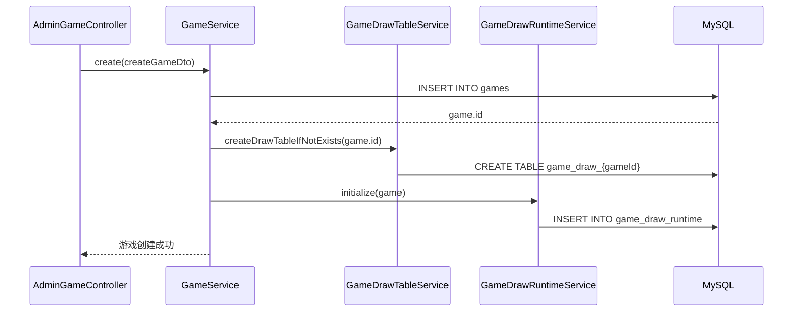
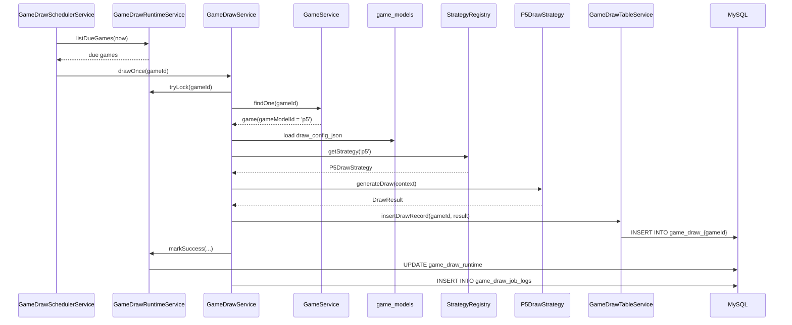

# 游戏创建自动建表与自动开奖时序设计

> 本文档描述两条核心时序：
>
> 1. 创建游戏后自动建开奖表
> 2. 调度器自动执行开奖

---

## 1. 参与对象

### 1.1 创建游戏链路

- `AdminGameController`
- `GameService`（或后续应用服务）
- `GameDrawTableService`
- `GameDrawRuntimeService`
- `games`
- `game_draw_runtime`
- `game_draw_{gameId}`

### 1.2 自动开奖链路

- `GameDrawSchedulerService`
- `GameDrawRuntimeService`
- `GameService`
- `GameModelService` / `game_models`
- `GameDrawStrategyRegistry`
- `P5DrawStrategy`（第一版）
- `GameDrawTableService`
- `game_draw_runtime`
- `game_draw_job_logs`
- `game_draw_{gameId}`

---

## 2. 创建游戏自动建表时序

## 2.1 目标

在管理员创建游戏成功后，系统自动：

1. 建立独立开奖结果表
2. 初始化运行时状态表
3. 将该游戏纳入后续自动开奖范围

## 2.2 时序步骤

```text
AdminGameController
  -> GameService.create(createGameDto)
    -> 校验 category / gameModel / label
    -> 写入 games
    -> 返回新 game.id
    -> GameDrawTableService.createDrawTableIfNotExists(game.id)
      -> 生成表名 game_draw_{gameId}
      -> 执行 CREATE TABLE IF NOT EXISTS
    -> GameDrawRuntimeService.initialize(game)
      -> 写入 game_draw_runtime
         - game_id
         - game_model_id = game.gameModelId
         - draw_table_name = game_draw_{gameId}
         - next_draw_at = now + drawInterval
         - status = idle
    -> 返回创建成功
```

## 2.3 失败补偿流程

```text
若 games 已写入成功
  且动态开奖表创建失败
    -> 记录错误日志
    -> 删除该 games 记录 或 标记为不可用
    -> 返回创建失败
```

## 2.4 推荐补偿策略

优先推荐：

1. 先插入 `games`
2. 再创建动态开奖表
3. 再插入 `game_draw_runtime`
4. 若 2 或 3 失败：
   - 删除刚创建的 `games`
   - 记录失败日志

---

## 3. 自动开奖时序

## 3.1 目标

调度器按时间扫描到期游戏，并自动完成开奖写入。

## 3.2 时序步骤

```text
GameDrawSchedulerService.scanAndDispatch()
  -> GameDrawRuntimeService.listDueGames(now)
    -> 查询 status in (idle, error) and next_draw_at <= now
  -> 遍历待开奖游戏
    -> GameDrawService.drawOnce(gameId)
      -> GameDrawRuntimeService.tryLock(gameId)
         -> select ... for update
         -> status = drawing
         -> locked_at = now
      -> GameService.findOne(gameId)
      -> 读取 game.gameModelId
      -> 读取 game_models.draw_config_json
      -> GameDrawStrategyRegistry.getStrategy(gameModelId)
      -> strategy.generateDraw(context)
      -> GameDrawTableService.insertDrawRecord(gameId, result)
         -> insert into game_draw_{gameId}
      -> GameDrawRuntimeService.markSuccess(...)
         -> 更新 last_draw_at
         -> 更新 next_draw_at
         -> 更新 current_issue
         -> status = idle
      -> 写入 game_draw_job_logs(success)
```

---

## 4. 自动开奖异常时序

## 4.1 策略不存在

```text
GameDrawService.drawOnce(gameId)
  -> registry.getStrategy(gameModelId)
  -> 未找到策略
  -> GameDrawRuntimeService.markError(gameId, '未找到对应开奖策略')
  -> 写入 game_draw_job_logs(failed)
```

## 4.2 动态开奖表不存在

推荐两种策略二选一：

### 策略 A：直接失败

```text
insertDrawRecord(gameId, result)
  -> 表不存在
  -> 标记 error
  -> 记录日志
```

### 策略 B：自动补建（推荐）

```text
insertDrawRecord(gameId, result)
  -> 表不存在
  -> createDrawTableIfNotExists(gameId)
  -> 重试插入
  -> 若仍失败则标记 error
```

我更推荐：

- 第一版使用策略 B

因为它更适合恢复误删表或初始化异常场景。

## 4.3 开奖结果写入失败

```text
strategy.generateDraw(context)
  -> 已生成结果
  -> insertDrawRecord() 失败
  -> GameDrawRuntimeService.markError(gameId, error.message)
  -> 写入 game_draw_job_logs(failed)
```

---

## 5. 手动开奖时序

## 5.1 目标

管理员在后台点击“立即开奖”后，手动为某个游戏开奖一次。

## 5.2 时序步骤

```text
AdminGameController.manualDraw(gameId)
  -> GameDrawService.manualDraw(gameId)
    -> 校验游戏存在
    -> 校验游戏允许开奖
    -> 可复用 drawOnce(gameId)
    -> source_type = manual
    -> 返回最新开奖记录
```

## 5.3 手动开奖与自动开奖关系

建议：

- 统一复用 `drawOnce(gameId)` 主流程
- 手动开奖仅额外传入 `sourceType = manual`
- 成功后同样推进 `next_draw_at`

---

## 6. Mermaid 时序图（创建游戏）



---

## 7. Mermaid 时序图（自动开奖）



---

## 8. 时序设计中的关键决策

### 8.1 使用 `game_models.id` 作为策略匹配键

例如：

- `p5`
- `pk10`
- `k3`

好处：

- 不需要额外 `strategy_key`
- 模型配置与代码策略一一对应
- 运营可读性也足够强

### 8.2 动态开奖表统一结构

时序上所有策略最终都返回统一 `DrawResult`，因此写表流程可以统一。

### 8.3 运行时状态单独维护

这样调度器不需要频繁扫所有 `games`，只扫 `game_draw_runtime` 即可。

---

## 9. 建议下一步

如果这份时序你确认，我下一步建议进入：

1. `SQL` 正式建表脚本
2. `game-draw` 模块骨架代码
3. `P5DrawStrategy` 第一版实现
4. 创建游戏后自动建表的服务编排实现
